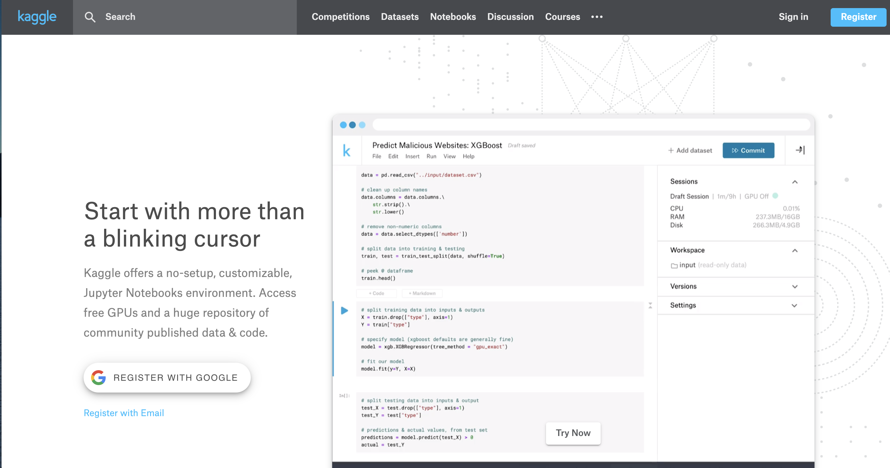
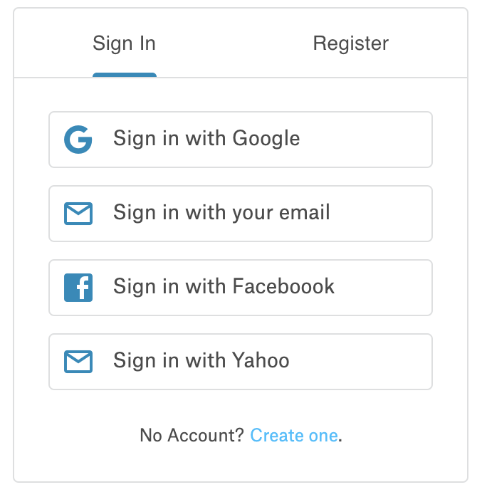
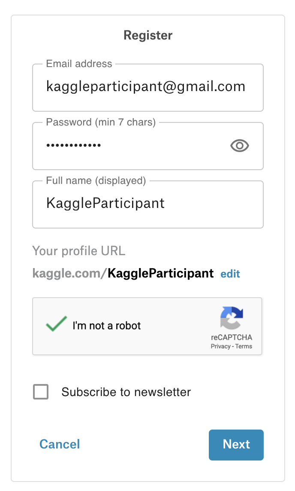

# Kaggle and The Boston Housing Dataset

## Introduction

Kaggle hosts numerous Data Science competitions where you can grab datasets and practice your skills at creating machine learning algorithms to answer useful questions. Here we'll sign up for an account and begin investigating a classic Data Science problem using the Boston housing dataset.

## Objectives

* Create a Kaggle account and download a dataset 

## Sign up
* Navigate to [kaggle.com](https://www.kaggle.com)

* Click "Sign in" and then 
* Click "Create one" to make a new account

* Fill out the basic information

* Accept the Privacy and Terms agreement

## Congratulations! 

You should now be signed up for Kaggle where you'll have access to a range of datasets, competitions, and other Data Science resources! Welcome to the community!

## Summary

In our upcoming lab, you'll then be working with this dataset: https://www.kaggle.com/c/boston-housing. To download it, click on the "data" tab and then click the "download all" to get a copy of the data.
